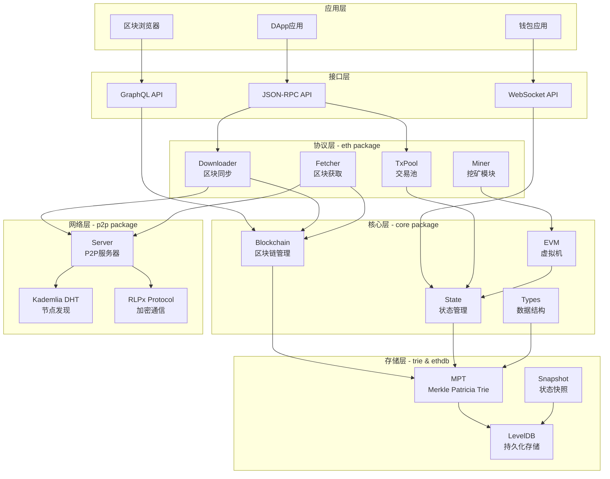
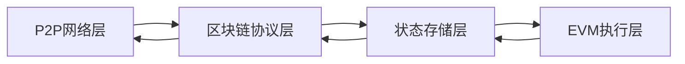
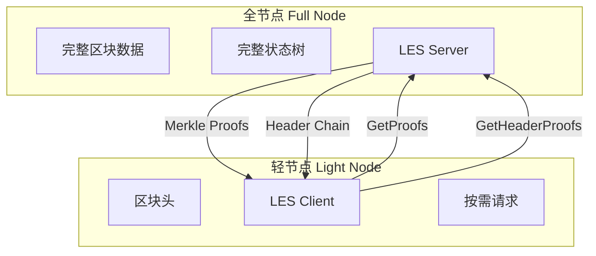
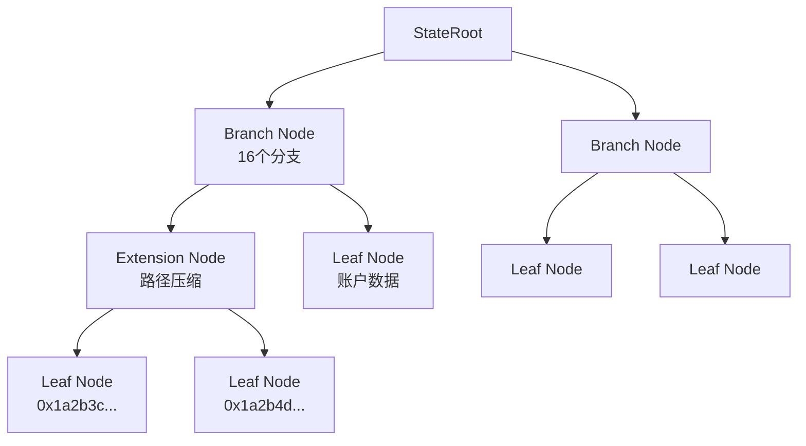
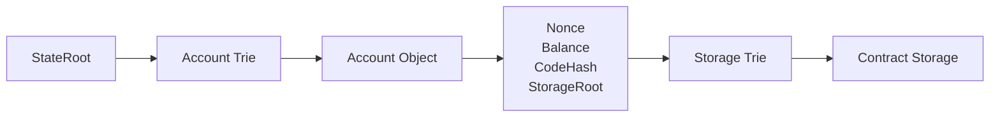
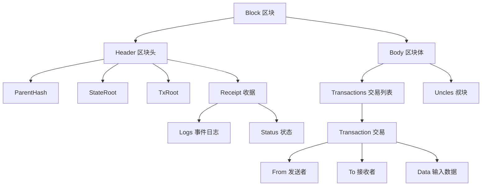
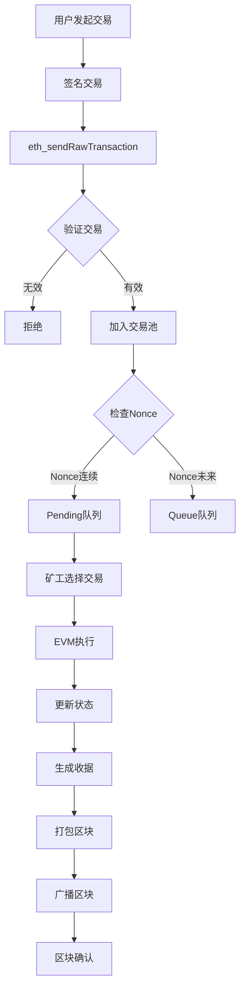
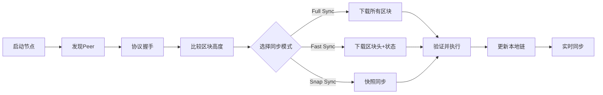
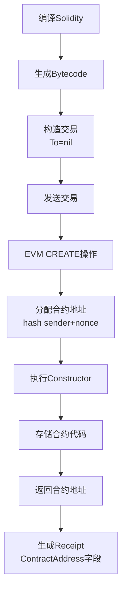
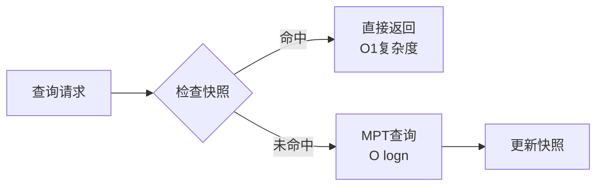

# Go-Ethereum 架构设计

## 一、分层架构图

### 1.1 整体架构



### 1.2 四层架构详解



#### 各层职责说明

| 层级 | 核心职责 | 关键模块 |
|------|---------|----------|
| **P2P网络层** | 节点发现、消息传播、网络通信 | p2p/server, p2p/discover |
| **区块链协议层** | 区块同步、交易传播、共识验证 | eth/downloader, eth/fetcher |
| **状态存储层** | 状态树管理、数据持久化 | trie, ethdb, core/state |
| **EVM执行层** | 智能合约执行、交易处理 | core/vm, core/types |

---

## 二、核心模块详细说明

### 2.1 LES（Light Ethereum Subprotocol）轻节点协议

#### 架构图



#### LES协议特点

**对比全节点：**
```
全节点（Full Node）
├── 存储：所有区块 + 所有状态（~1TB+）
├── 验证：完整验证所有交易
├── 同步：下载完整区块链
└── 资源：高CPU + 大硬盘 + 大带宽

轻节点（Light Node）
├── 存储：仅区块头（~1GB）
├── 验证：通过Merkle证明验证
├── 同步：快速同步区块头
└── 资源：低资源消耗
```

#### LES协议消息类型

```go
// LES/2 协议消息（简化）
const (
    GetBlockHeadersMsg = 0x00  // 请求区块头
    BlockHeadersMsg    = 0x01  // 区块头响应
    
    GetProofsV2Msg     = 0x0f  // 请求Merkle证明
    ProofsV2Msg        = 0x10  // Merkle证明响应
    
    GetHelperTrieProofsMsg = 0x11  // 请求辅助树证明
    HelperTrieProofsMsg    = 0x12  // 辅助树证明响应
)
```

#### 实现原理

```
轻节点查询账户余额流程：
1. 轻节点只有区块头（包含StateRoot）
    ↓
2. 向全节点请求账户的Merkle证明
   Request: GetProofs(address, stateRoot)
    ↓
3. 全节点返回从StateRoot到账户的路径
   Response: Proofs[node1, node2, ..., account]
    ↓
4. 轻节点验证Merkle路径
   Verify: Hash(node1 + node2 + ...) == StateRoot
    ↓
5. 提取账户数据（余额、Nonce等）
```

**代码示例（轻节点请求）：**
```go
// 轻节点请求账户证明
func (lc *LightClient) GetBalance(address common.Address) *big.Int {
    // 1. 获取最新区块头
    header := lc.GetLatestHeader()
    
    // 2. 请求账户的Merkle证明
    proof := lc.RequestProof(address, header.Root)
    
    // 3. 验证证明并提取余额
    account := VerifyProof(proof, header.Root)
    return account.Balance
}
```

---

### 2.2 Trie（Merkle Patricia Trie）默克尔树实现

#### MPT结构图



#### 三种节点类型

```
1. Branch Node（分支节点）
   [v0, v1, v2, ..., v15, value]
   - 16个子节点（对应十六进制 0-F）
   - 1个可选值字段

2. Extension Node（扩展节点）
   [encodedPath, key]
   - 路径压缩，存储公共前缀
   - 指向下一个节点的哈希

3. Leaf Node（叶子节点）
   [encodedPath, value]
   - 存储最终的键值对
   - Value可以是账户数据或存储数据
```

#### 账户状态存储



**账户对象结构：**
```go
type Account struct {
    Nonce    uint64           // 交易计数器
    Balance  *big.Int         // 账户余额
    Root     common.Hash      // 存储树根（合约账户）
    CodeHash []byte           // 合约代码哈希
}
```

#### MPT关键操作

**1. 插入（Insert）**
```
插入 Key="0x1a2b", Value="Account Data"

步骤：
1. 从Root开始，找到路径 0x1a2b
2. 如果路径不存在，创建Extension节点压缩公共前缀
3. 创建Leaf节点存储Value
4. 更新所有父节点的哈希
5. 返回新的Root哈希
```

**2. 查询（Get）**
```go
// 从MPT中查询账户
func (t *Trie) Get(key []byte) []byte {
    // 1. 转换key为hex格式
    hexKey := keybytesToHex(key)
    
    // 2. 从根节点开始遍历
    node := t.root
    for len(hexKey) > 0 {
        switch n := node.(type) {
        case *BranchNode:
            // 根据第一个字符选择分支
            node = n.Children[hexKey[0]]
            hexKey = hexKey[1:]
            
        case *ExtensionNode:
            // 跳过公共前缀
            hexKey = hexKey[len(n.Path):]
            node = n.Next
            
        case *LeafNode:
            // 找到目标节点
            return n.Value
        }
    }
    return nil
}
```

**3. 删除（Delete）**
```
删除操作会触发节点合并：
1. 找到目标节点并删除
2. 如果Branch节点只剩<2个子节点，转换为Extension
3. 合并相邻的Extension节点
4. 重新计算Root哈希
```

#### Secure Trie（安全树）

Geth使用Secure Trie，对Key进行Keccak256哈希：

```go
// 安全树实现
type SecureTrie struct {
    trie Trie
}

func (t *SecureTrie) Update(key, value []byte) {
    // 对key进行哈希，防止路径碰撞攻击
    hashedKey := crypto.Keccak256(key)
    t.trie.Update(hashedKey, value)
}
```

**优势：**
- 防止恶意构造深度路径攻击
- 统一Key长度为32字节
- 提高查询性能

---

### 2.3 Core/Types（区块数据结构）

#### 核心数据结构关系



#### 区块头（Header）结构

```go
type Header struct {
    ParentHash  common.Hash    // 父区块哈希
    UncleHash   common.Hash    // 叔块哈希
    Coinbase    common.Address // 矿工地址
    Root        common.Hash    // 状态树根
    TxHash      common.Hash    // 交易树根
    ReceiptHash common.Hash    // 收据树根
    Bloom       Bloom          // 日志布隆过滤器
    Difficulty  *big.Int       // 难度值
    Number      *big.Int       // 区块号
    GasLimit    uint64         // Gas限制
    GasUsed     uint64         // 已使用Gas
    Time        uint64         // 时间戳
    Extra       []byte         // 额外数据
    MixDigest   common.Hash    // PoW混合哈希
    Nonce       BlockNonce     // PoW随机数
    
    // PoS新增字段（The Merge后）
    BaseFee     *big.Int       // EIP-1559 基础费用
}
```

#### 交易（Transaction）结构

**传统交易（Legacy）：**
```go
type LegacyTx struct {
    Nonce    uint64          // 账户交易序号
    GasPrice *big.Int        // Gas价格
    Gas      uint64          // Gas限制
    To       *common.Address // 接收地址（nil为创建合约）
    Value    *big.Int        // 转账金额
    Data     []byte          // 输入数据
    V, R, S  *big.Int        // ECDSA签名
}
```

**EIP-1559交易：**
```go
type DynamicFeeTx struct {
    Nonce      uint64
    GasTipCap  *big.Int   // 最大小费
    GasFeeCap  *big.Int   // 最大费用
    Gas        uint64
    To         *common.Address
    Value      *big.Int
    Data       []byte
    AccessList AccessList // 访问列表（EIP-2930）
    V, R, S    *big.Int
}
```

#### 交易收据（Receipt）

```go
type Receipt struct {
    Type              uint8       // 交易类型（0=Legacy, 2=EIP-1559）
    Status            uint64      // 执行状态（1=成功, 0=失败）
    CumulativeGasUsed uint64      // 累计Gas消耗
    Bloom             Bloom       // 日志布隆过滤器
    Logs              []*Log      // 事件日志
    
    // 后处理字段
    TxHash          common.Hash
    ContractAddress common.Address // 创建的合约地址
    GasUsed         uint64         // 本交易Gas消耗
}
```

#### 事件日志（Log）

```go
type Log struct {
    Address common.Address // 合约地址
    Topics  []common.Hash  // 索引主题（最多4个）
    Data    []byte         // 非索引数据
    
    // 元数据
    BlockNumber uint64
    TxHash      common.Hash
    TxIndex     uint
    BlockHash   common.Hash
    Index       uint
}
```

**日志索引示例：**
```solidity
// Solidity事件定义
event Transfer(
    address indexed from,
    address indexed to,
    uint256 value
);

// 触发事件
emit Transfer(0xAlice, 0xBob, 100);

// 生成Log结构
Log {
    Address: 0xTokenContract,
    Topics: [
        keccak256("Transfer(address,address,uint256)"), // Topic[0]
        0xAlice,  // Topic[1] - indexed
        0xBob     // Topic[2] - indexed
    ],
    Data: abi.encode(100)  // 非indexed参数
}
```

#### 布隆过滤器（Bloom Filter）

用于快速检索日志：

```go
// 2048位布隆过滤器
type Bloom [256]byte

// 添加地址或Topic到布隆过滤器
func (b *Bloom) Add(data []byte) {
    hash := crypto.Keccak256(data)
    // 使用3个哈希函数设置位
    for i := 0; i < 6; i += 2 {
        bit := binary.BigEndian.Uint16(hash[i:]) % 2048
        b[bit/8] |= 1 << (bit % 8)
    }
}

// 快速检查可能存在（有误报，无漏报）
func (b Bloom) Test(data []byte) bool {
    // 检查3个位是否都为1
}
```

---

## 三、模块交互流程图

### 3.1 交易处理完整流程



### 3.2 区块同步流程



### 3.3 智能合约部署流程



---

## 四、性能优化设计

### 4.1 状态快照（Snapshot）

传统MPT查询需要多次磁盘IO，快照加速状态访问：



**快照层级：**
```
Disk Layer（磁盘层）
    ↑
Diff Layer 1 (最近128个块)
    ↑
Diff Layer 2
    ↑
Diff Layer N (内存层)
```

### 4.2 缓存机制

Geth多级缓存策略：

```
L1: 最近访问的账户（LRU缓存）
    ↓ 未命中
L2: Trie节点缓存（内存）
    ↓ 未命中
L3: LevelDB Block Cache
    ↓ 未命中
L4: 磁盘读取
```

### 4.3 批处理写入

```go
// 批量写入优化
batch := db.NewBatch()
for _, tx := range block.Transactions() {
    // 累积状态变更
    batch.Put(key, value)
}
// 一次性提交
batch.Write()
```

---

## 五、代码组织结构

```
go-ethereum/
├── core/                    # 核心逻辑
│   ├── blockchain.go       # 区块链管理
│   ├── state/              # 状态管理
│   │   ├── statedb.go     # 状态数据库
│   │   └── state_object.go # 账户对象
│   ├── types/              # 数据结构
│   │   ├── block.go       # 区块定义
│   │   ├── transaction.go # 交易定义
│   │   └── receipt.go     # 收据定义
│   ├── vm/                 # 虚拟机
│   │   ├── evm.go         # EVM实现
│   │   ├── interpreter.go # 字节码解释器
│   │   └── instructions.go # 指令集
│   └── txpool/             # 交易池
│
├── eth/                     # 以太坊协议
│   ├── downloader/         # 区块同步
│   ├── fetcher/            # 区块获取
│   ├── protocols/          # 子协议
│   │   ├── eth/           # eth/66协议
│   │   └── snap/          # snap/1协议
│   └── catalyst/           # Engine API（PoS）
│
├── les/                     # 轻节点协议
│   ├── client.go           # LES客户端
│   ├── server.go           # LES服务端
│   └── odr.go              # 按需检索
│
├── trie/                    # Merkle树
│   ├── trie.go             # MPT实现
│   ├── secure_trie.go      # 安全树
│   ├── database.go         # Trie数据库
│   └── stacktrie.go        # 栈式树（优化）
│
├── ethdb/                   # 数据库抽象
│   ├── leveldb/            # LevelDB实现
│   └── memorydb/           # 内存数据库（测试）
│
├── p2p/                     # P2P网络
│   ├── server.go           # P2P服务器
│   ├── peer.go             # 对等节点
│   ├── discover/           # 节点发现
│   │   ├── v4wire/        # discv4协议
│   │   └── v5wire/        # discv5协议
│   └── enode/              # 节点标识
│
├── miner/                   # 挖矿
│   ├── miner.go            # 矿工主逻辑
│   └── worker.go           # 工作线程
│
├── consensus/               # 共识算法
│   ├── ethash/             # Ethash（PoW）
│   ├── clique/             # Clique（PoA）
│   └── beacon/             # Beacon（PoS）
│
├── rpc/                     # RPC服务
│   ├── server.go           # RPC服务器
│   ├── client.go           # RPC客户端
│   └── websocket.go        # WebSocket
│
└── cmd/geth/                # Geth命令行
    └── main.go
```

---

## 六、关键设计模式

### 6.1 接口抽象

```go
// 数据库接口抽象
type Database interface {
    Get(key []byte) ([]byte, error)
    Put(key []byte, value []byte) error
    Delete(key []byte) error
}

// 可替换不同实现
var db Database
db = NewLevelDB()  // 或 NewMemoryDB()
```

### 6.2 事件订阅

```go
// 事件系统
type BlockChain struct {
    chainHeadFeed event.Feed
}

// 订阅新区块事件
ch := make(chan ChainHeadEvent)
sub := blockchain.SubscribeChainHeadEvent(ch)

for event := range ch {
    fmt.Println("New block:", event.Block.Number())
}
```

### 6.3 并发安全

```go
// 使用读写锁保护状态
type StateDB struct {
    mu sync.RWMutex
    accounts map[common.Address]*Account
}

func (s *StateDB) GetBalance(addr common.Address) *big.Int {
    s.mu.RLock()
    defer s.mu.RUnlock()
    return s.accounts[addr].Balance
}
```

---

## 七、总结

Geth的架构设计体现了以下核心思想：

1. **模块化分层**：清晰的层次划分，降低耦合
2. **接口抽象**：便于测试和替换实现
3. **性能优化**：多级缓存、批处理、快照加速
4. **可扩展性**：插件化共识算法、协议版本管理
5. **安全性**：Secure Trie防御攻击、签名验证

这种设计使得Geth能够高效、安全地运行以太坊网络，同时为开发者提供了灵活的扩展能力。
