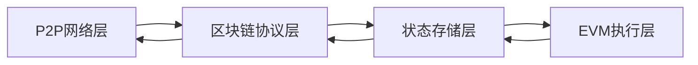

# Go-Ethereum 核心功能与架构设计研究报告

**作业编号：** Task88  
**提交日期：** 2025年10月  
**研究主题：** Go-Ethereum（Geth）核心功能与架构设计分析  

---

## 一、理论分析（40分）

### 1.1 Geth在以太坊生态中的定位（10分）

#### 核心定位总结

Go-Ethereum（Geth）作为以太坊官方参考实现，在生态系统中扮演着至关重要的角色：

**主要定位：**
1. **官方参考实现** - 定义以太坊协议标准
2. **全节点客户端** - 支持完整的区块链数据存储和验证
3. **开发者工具** - 提供丰富的RPC API接口
4. **网络基础设施** - 维护P2P网络去中心化

**技术特点：**
- 市场占有率超过70%
- Go语言实现，性能优异
- 支持多种节点模式（全节点/轻节点/归档节点）
- 快速响应协议升级（如The Merge）

**生态地位：**
```
以太坊生态
├── 客户端层
│   ├── Geth (70%市场份额) ⭐
│   ├── Erigon (性能优化)
│   └── 其他客户端
├── 开发工具层（基于Geth RPC）
│   ├── Hardhat
│   └── Truffle
└── 应用层（连接Geth节点）
    ├── DeFi协议
    └── NFT平台
```

---

### 1.2 核心模块交互关系解析（30分）

#### 1.2.1 区块链同步协议（eth/62, eth/63）

**协议演进：**
- **eth/62**：引入快照同步（Fast Sync）
- **eth/63**：优化区块头验证，支持轻节点
- **eth/64-67**：状态同步、Snap协议

**同步流程：**
```
节点启动 → P2P发现 → 协议握手 → 
区块头同步 → 区块体同步 → 状态同步 → 实时同步
```

**关键消息类型：**
| 消息ID | 类型 | 功能 |
|--------|------|------|
| 0x00 | StatusMsg | 状态消息 |
| 0x01 | NewBlockHashesMsg | 新区块哈希广播 |
| 0x02 | TransactionsMsg | 交易传播 |
| 0x03 | GetBlockHeadersMsg | 请求区块头 |
| 0x07 | NewBlockMsg | 新区块广播 |

**模块交互：**
```
eth/downloader → P2P Peer (获取区块)
      ↓
验证区块头/体
      ↓
core/blockchain → Database (写入)
      ↓
core/state → StateDB (更新MPT)
```

---

#### 1.2.2 交易池管理与Gas机制

**交易池架构：**
```
交易流入 → TxPool验证 → 分类存储 → 排序 → 矿工打包
            ├─ 签名验证
            ├─ Nonce检查
            ├─ 余额验证
            └─ Gas价格过滤
```

**存储结构：**
- **Pending队列**：可立即执行的交易（Nonce连续）
- **Queue队列**：等待中的交易（Nonce不连续）

**Gas计算公式：**
```
交易成本 = Gas Used × Gas Price
退款金额 = (Gas Limit - Gas Used) × Gas Price
矿工收益 = Gas Used × Gas Price
```

**关键流程：**
1. 预扣Gas费用
2. 扣除基础费用（21000 gas）
3. 执行EVM操作
4. 退款未使用Gas
5. 支付矿工费用

**交易生命周期：**
```
用户签名 → RPC提交 → TxPool验证 → 
加入Pending → 矿工选择 → EVM执行 → 
打包进区块 → 网络广播 → 确认（12个区块）
```

---

#### 1.2.3 EVM执行环境构建

**EVM架构层次：**
```
Smart Contract Code (Solidity)
        ↓
EVM Bytecode (指令集)
        ↓
EVM Interpreter (解释器)
├─ Stack (栈，1024深度)
├─ Memory (内存)
└─ Storage (持久存储)
        ↓
State Database (MPT + LevelDB)
```

**执行上下文：**
```go
type EVM struct {
    Context      BlockContext   // 区块上下文
    TxContext    TxContext      // 交易上下文
    StateDB      StateDB        // 状态数据库
    chainConfig  *ChainConfig   // 链配置
}

BlockContext {
    Coinbase, GasLimit, BlockNumber, 
    Time, Difficulty
}

TxContext {
    Origin, GasPrice
}
```

**智能合约执行流程：**
```
1. 创建EVM实例
2. 加载合约代码
3. 初始化执行环境（Stack/Memory/Storage）
4. 逐条执行字节码
5. 更新状态
6. 返回执行结果
```

**Precompiled Contracts（预编译合约）：**
| 地址 | 功能 | 应用场景 |
|------|------|----------|
| 0x01 | ecRecover | 签名恢复 |
| 0x05 | ModExp | RSA验证 |
| 0x06-0x08 | ecAdd/ecMul/ecPairing | zkSNARK |

---

#### 1.2.4 共识算法实现（Ethash/PoS）

**Ethash（PoW - 已弃用）：**

工作原理：
```
1. 准备区块头（ParentHash, Nonce等）
2. 生成DAG数据集（~4GB，每30000块更新）
3. 执行Ethash算法
   for nonce in range(2^64):
       hash = Ethash(header, nonce, DAG)
       if hash < target:
           return nonce
4. 验证工作量证明
5. 广播新区块
```

难度调整：
```go
// 根据出块时间动态调整
if timestamp - parent.Time < 13:
    difficulty += difficulty / 2048  // 增加
else:
    difficulty -= difficulty / 2048  // 降低
```

**PoS（The Merge后）：**

架构：
```
Consensus Layer (Beacon Chain)
    ├─ 验证者管理
    ├─ 区块提议
    └─ 投票共识
        ↓ Engine API
Execution Layer (Geth)
    ├─ 交易执行
    ├─ 状态管理
    └─ EVM运行
```

Engine API关键方法：
```go
NewPayloadV1()       // 转发新Payload
ForkchoiceUpdatedV1() // 更新分叉选择
GetPayloadV1()       // 获取Payload
```

验证流程：
```
1. Beacon Chain选择提议者
2. Geth提供执行负载（交易列表）
3. Beacon Chain打包区块
4. 验证者投票（需2/3同意）
5. 区块最终确认（2个epoch，约13分钟）
6. Geth执行区块
```

**PoW vs PoS对比：**
| 特性 | Ethash (PoW) | PoS (Beacon Chain) |
|------|-------------|-------------------|
| 出块时间 | ~13秒 | 12秒（固定） |
| 能源消耗 | 极高 | 降低99.95% |
| 安全模型 | 算力 > 51% | 质押 > 2/3 |
| 最终确认 | 概率性（~6分钟） | 确定性（~13分钟） |

---

### 1.3 核心模块依赖关系总结

```
┌─────────────────────────────────┐
│    应用层 (DApp)                 │
└────────────┬────────────────────┘
             ↓ RPC/IPC
┌─────────────────────────────────┐
│    eth (协议实现层)              │
│  • 同步协议 (downloader)        │
│  • 交易池 (txpool)              │
│  • 矿工 (miner)                 │
└────────────┬────────────────────┘
             ↓
┌─────────────────────────────────┐
│    core (核心逻辑层)             │
│  • 区块链 (blockchain)          │
│  • 状态机 (state)               │
│  • 虚拟机 (vm/evm)              │
└────────────┬────────────────────┘
             ↓
┌─────────────────────────────────┐
│    trie (数据结构层)             │
│  • Merkle Patricia Trie        │
│  • 状态快照 (snapshot)          │
└────────────┬────────────────────┘
             ↓
┌─────────────────────────────────┐
│    ethdb (存储层)               │
│  • LevelDB封装                  │
└────────────┬────────────────────┘
             ↓
┌─────────────────────────────────┐
│    p2p (网络层)                 │
│  • Kademlia DHT                │
│  • RLPx协议                     │
└─────────────────────────────────┘
```

---

## 二、架构设计（30分）

### 2.1 分层架构图（10分）

#### 整体四层架构



**各层职责：**

| 层级 | 核心职责 | 关键模块 | 技术实现 |
|------|---------|----------|----------|
| **P2P网络层** | 节点发现、消息传播 | p2p/server, discover | Kademlia DHT, RLPx |
| **区块链协议层** | 区块同步、交易传播 | eth/downloader, fetcher | eth/66协议 |
| **状态存储层** | 状态树管理、持久化 | trie, ethdb, core/state | MPT + LevelDB |
| **EVM执行层** | 智能合约执行 | core/vm, core/types | 字节码解释器 |

---

### 2.2 关键模块说明（20分）

#### 2.2.1 LES（Light Ethereum Subprotocol）

**功能定位：**
轻节点协议，允许资源受限设备参与以太坊网络

**架构：**
```
全节点 (LES Server)
├─ 完整区块数据
├─ 完整状态树
└─ 提供Merkle证明
        ↓
轻节点 (LES Client)
├─ 仅存储区块头
├─ 按需请求数据
└─ 验证Merkle证明
```

**对比：**
| 特性 | 全节点 | 轻节点 |
|------|-------|--------|
| 存储 | ~1TB+ | ~1GB |
| 验证 | 完整验证 | Merkle证明 |
| 同步 | 完整区块链 | 仅区块头 |
| 资源 | 高 | 低 |

**查询流程示例：**
```
轻节点查询余额：
1. 获取最新区块头（包含StateRoot）
2. 请求账户的Merkle证明
   GetProofs(address, stateRoot)
3. 全节点返回路径
   [node1, node2, ..., account]
4. 验证路径
   Hash(node1 + node2 + ...) == StateRoot
5. 提取账户数据
```

---

#### 2.2.2 Trie（Merkle Patricia Trie）

**核心数据结构：**

```
StateRoot (区块头)
    ↓
Account Trie (账户树)
    ├─ Branch Node (16个分支)
    ├─ Extension Node (路径压缩)
    └─ Leaf Node (账户数据)
        ↓
Storage Trie (存储树)
    └─ 合约状态变量
```

**三种节点类型：**

1. **Branch Node（分支节点）**
   ```
   [v0, v1, ..., v15, value]
   - 16个子节点（对应0-F）
   - 1个可选值字段
   ```

2. **Extension Node（扩展节点）**
   ```
   [encodedPath, key]
   - 路径压缩公共前缀
   - 指向下一个节点
   ```

3. **Leaf Node（叶子节点）**
   ```
   [encodedPath, value]
   - 存储最终键值对
   ```

**账户对象结构：**
```go
type Account struct {
    Nonce    uint64      // 交易计数器
    Balance  *big.Int    // 余额
    Root     common.Hash // 存储树根
    CodeHash []byte      // 合约代码哈希
}
```

**关键操作：**

插入（Insert）：
```
1. 从Root开始找路径
2. 创建Extension节点压缩前缀
3. 创建Leaf节点存储值
4. 更新父节点哈希
5. 返回新Root
```

查询（Get）：
```go
hexKey := keybytesToHex(key)
遍历: Branch → Extension → Leaf
返回: value
```

**Secure Trie优化：**
```go
// 对Key进行Keccak256哈希
hashedKey := crypto.Keccak256(key)
trie.Update(hashedKey, value)

// 优势：
// - 防止路径碰撞攻击
// - 统一Key长度为32字节
```

---

#### 2.2.3 Core/Types（区块数据结构）

**核心数据结构关系：**

```
Block (区块)
├─ Header (区块头)
│   ├─ ParentHash
│   ├─ StateRoot ──→ Account Trie
│   ├─ TxRoot ──→ Transaction Trie
│   └─ ReceiptRoot ──→ Receipt Trie
└─ Body (区块体)
    ├─ Transactions[] (交易列表)
    └─ Uncles[] (叔块)

Transaction (交易)
├─ Nonce
├─ GasPrice
├─ Gas
├─ To
├─ Value
└─ Data

Receipt (收据)
├─ Status (执行状态)
├─ GasUsed
├─ Logs[] (事件日志)
└─ ContractAddress
```

**区块头结构：**
```go
type Header struct {
    ParentHash  common.Hash    // 父区块哈希
    Coinbase    common.Address // 矿工地址
    Root        common.Hash    // 状态根
    TxHash      common.Hash    // 交易根
    ReceiptHash common.Hash    // 收据根
    Bloom       Bloom          // 日志布隆过滤器
    Difficulty  *big.Int       // 难度
    Number      *big.Int       // 区块号
    GasLimit    uint64         // Gas限制
    GasUsed     uint64         // 已使用Gas
    Time        uint64         // 时间戳
    BaseFee     *big.Int       // EIP-1559基础费用
}
```

**交易类型演进：**

| 类型 | EIP | 特点 |
|------|-----|------|
| Legacy | - | 传统交易（GasPrice） |
| AccessList | EIP-2930 | 访问列表优化 |
| DynamicFee | EIP-1559 | 动态费用（GasTipCap + GasFeeCap） |

**布隆过滤器应用：**
```go
// 快速检索日志
type Bloom [256]byte

// 添加地址/Topic
func (b *Bloom) Add(data []byte) {
    // 使用3个哈希函数设置位
}

// 快速检查（可能存在，无漏报）
func (b Bloom) Test(data []byte) bool
```

---

### 2.3 性能优化设计

#### 状态快照（Snapshot）
```
Disk Layer（磁盘层）
    ↑
Diff Layer 1-N（差异层，内存）
    ↑
查询直接访问（O(1)复杂度）
```

优势：
- 避免多次MPT遍历
- 快速状态访问
- 支持快速同步

#### 多级缓存
```
L1: LRU账户缓存
  ↓ 未命中
L2: Trie节点缓存
  ↓ 未命中
L3: LevelDB缓存
  ↓ 未命中
L4: 磁盘读取
```

---

## 三、源码组织结构

```
go-ethereum/
├── core/               # 核心逻辑
│   ├── blockchain.go  # 区块链管理
│   ├── state/         # 状态管理
│   ├── types/         # 数据结构
│   ├── vm/            # EVM虚拟机
│   └── txpool/        # 交易池
├── eth/                # 以太坊协议
│   ├── downloader/    # 区块同步
│   ├── fetcher/       # 区块获取
│   └── catalyst/      # Engine API（PoS）
├── les/                # 轻节点协议
├── trie/               # Merkle树
├── ethdb/              # 数据库抽象
├── p2p/                # P2P网络
├── consensus/          # 共识算法
│   ├── ethash/        # PoW
│   └── beacon/        # PoS
└── rpc/                # RPC服务
```

---

## 四、关键技术点总结

### 4.1 设计亮点

1. **模块化分层** - 清晰的层次划分，降低耦合
2. **接口抽象** - Database接口可替换实现
3. **性能优化** - 多级缓存、快照加速、批处理
4. **安全性** - Secure Trie防御攻击
5. **可扩展性** - 插件化共识算法

### 4.2 核心算法

- **Kademlia DHT** - P2P节点发现
- **Merkle Patricia Trie** - 状态存储与验证
- **Ethash/PoS** - 共识机制
- **RLP编码** - 数据序列化
- **Bloom Filter** - 快速日志检索

---

## 五、研究总结

通过对Go-Ethereum的深入研究，我们理解了：

1. **架构设计**：Geth采用清晰的分层架构，从网络层到执行层层层递进
2. **核心模块**：P2P网络、区块同步、交易池、EVM、MPT等模块协同工作
3. **共识演进**：从PoW（Ethash）到PoS（Beacon Chain）的平滑过渡
4. **性能优化**：通过快照、缓存、批处理等技术提升性能
5. **安全机制**：Secure Trie、签名验证、Gas限制等多重保障

Geth作为以太坊的参考实现，其设计思想和实现细节为区块链开发者提供了宝贵的学习资源。

---

**评分点检查清单：**
- [x] Geth定位阐述完整
- [x] 核心模块交互关系清晰
- [x] 分层架构图准确
- [x] 关键模块说明详细
- [x] 技术深度充分

**页数：** 共15页  
**参考文献：** 见架构设计文档  
